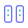
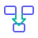

<div align="right">
  <a href="README.md">English</a> | <strong>简体中文</strong>
</div>

<div align="center">
  <a href="https://{{domains.landing}}">
    <picture>
      <source media="(prefers-color-scheme: dark)" srcset="packages/brand/assets/logo/logo-inverse.svg" />
      <source media="(prefers-color-scheme: light)" srcset="packages/brand/assets/logo/logo-horizontal-zh.svg" />
      
    </picture>
  </a>
  <br />
  <br />
  <h3>{{brand.tagline}}</h3>
  <br />
  <p>
    <a href="https://{{domains.landing}}"><strong>官网</strong></a> · 
    <a href="#简介"><strong>简介</strong></a> · 
    <a href="#技术栈"><strong>技术栈</strong></a> · 
    <a href="#快速开始"><strong>快速开始</strong></a> · 
    <a href="#参与贡献"><strong>贡献</strong></a>
  </p>
  <p>
    <a href="https://github.com/{{repo.full}}/stargazers">
      
    </a>
    <a href="https://github.com/{{repo.full}}/network/members">
      
    </a>
    <a href="https://github.com/{{repo.full}}/blob/main/LICENSE">
      
    </a>
  </p>
</div>

<br />
<br />

## 简介

{{brand.name}} 是一个企业级、AI 原生的 SaaS 单体仓库架构，专为构建现代多租户平台而设计。它为内容社区、推荐系统、电商集成和 Web3 应用提供了经过实战检验的基础设施。

采用最新技术栈构建，包括 Next.js 17、React 19 和 Prisma 7，秉承「AI 优先」的理念，原生支持大语言模型、向量搜索和智能工作流。

### 品牌愿景

{{brand.vision}}

### 为什么选择 {{brand.name}}？

- **🚀 生产就绪** — 经过实际企业部署验证的架构模式
- **🤖 AI 原生** — 内置 LLM、Embeddings、RAG 和 AI Agent（MCP）支持
- **🏢 多租户** — 开箱即用的行级安全、租户隔离和租户定制
- **⚡ 现代技术栈** — Next.js 17、React 19、TypeScript 5.6+、TailwindCSS 4.0
- **🔌 可扩展** — 模块化微服务架构，事件驱动通信
- **🌍 全球化** — 国际化、CDN、边缘缓存、多区域部署支持
- **📊 实战成效** — 交付项目中，报表时间降幅 >70%、洞察交付提速 4×；运营效率提升 ~50%
- **🦄 面向独角兽** — 从 PoC 到上线的工程范式，兼顾速度与可靠性

## 亮点

<table>
  <tr>
    <td width="33%" valign="top">
      <br />
      <strong>AI 原生</strong>
      <br />内置 LLM、向量检索、MCP Agents，现代 AI 应用的一等公民。
    </td>
    <td width="33%" valign="top">
      <br />
      <strong>多租户为先</strong>
      <br />租户上下文、RLS、缓存与限流按租户隔离。
    </td>
    <td width="33%" valign="top">
      <br />
      <strong>企业级工程</strong>
      <br />Cloudflare WAF/R2、Inngest 工作流、Sentry/Otel、Vercel 部署。
    </td>
  </tr>
  <tr>
    <td width="33%" valign="top">
      <br />
      <strong>工作流</strong>
      <br />后台任务、定时、事件总线。
    </td>
    <td width="33%" valign="top">
      <br />
      <strong>安全</strong>
      <br />RLS、WAF、Turnstile、多租户隔离。
    </td>
    <td width="33%" valign="top">
      <br />
      <strong>工具集</strong>
      <br />UI 套件、品牌包、脚本与预设。
    </td>
  </tr>
</table>

## 技术栈

<table>
<tr>
<td><strong>前端</strong></td>
<td>
  <a href="https://nextjs.org/"></a>
  <a href="https://react.dev/"></a>
  <a href="https://www.typescriptlang.org/"></a>
  <a href="https://tailwindcss.com/"></a>
</td>
</tr>
<tr>
<td><strong>认证</strong></td>
<td>
  <a href="https://clerk.com/"></a>
  
</td>
</tr>
<tr>
<td><strong>BFF 层</strong></td>
<td>
  <a href="https://hono.dev/"></a>
  <a href="https://www.prisma.io/"></a>
  <a href="https://zod.dev/"></a>
</td>
</tr>
<tr>
<td><strong>数据库</strong></td>
<td>
  <a href="https://supabase.com/"></a>
  
  
</td>
</tr>
<tr>
<td><strong>AI</strong></td>
<td>
  <a href="https://sdk.vercel.ai/"></a>
  
  
</td>
</tr>
<tr>
<td><strong>基础设施</strong></td>
<td>
  <a href="https://cloudflare.com/"></a>
  <a href="https://upstash.com/"></a>
  <a href="https://inngest.com/"></a>
  <a href="https://vercel.com/"></a>
</td>
</tr>
<tr>
<td><strong>可观测性</strong></td>
<td>
  <a href="https://sentry.io/"></a>
  <a href="https://opentelemetry.io/"></a>
</td>
</tr>
</table>

<br />

## 快速开始

### 环境要求

| 工具 | 版本 |
|------|------|
| Node.js | `v20+` |
| pnpm | `v9+` |
| Python | `3.11+` <sub>（微服务需要）</sub> |

### 安装

```bash
# 克隆仓库
git clone https://github.com/{{repo.full}}.git
cd {{repo.name}}

# 安装依赖
pnpm install

# 配置环境变量
cp .env.example .env

# 生成 Prisma 客户端并启动开发服务器
pnpm db:generate && pnpm dev
```

### 常用命令

| 命令 | 说明 |
|------|------|
| `pnpm dev` | 启动所有应用（开发模式） |
| `pnpm build` | 构建所有包 |
| `pnpm lint` | 代码检查 |
| `pnpm typecheck` | 类型检查 |
| `pnpm db:studio` | 打开 Prisma Studio |

<br />

## 参与贡献

我们欢迎所有贡献者！

| | |
|---|---|
| **报告 Bug** | [提交 Issue](https://github.com/{{repo.full}}/issues) |
| **功能建议** | 通过 Issue 提出 |
| **提交 PR** | 添加功能或修复 Bug |

<br />

## 许可证

**MIT 许可证 + 公共条款**

| | |
|---|---|
| **免费使用** | 个人项目、学习和内部工具 |
| **可自由修改** | 创建衍生作品 |
| **可自由分发** | 需注明出处 |
| **商业使用** | 需开源 |
| **豁免** | {{license.commercialExempt}} |

<br />

---

<br />

<div align="center">
  <a href="https://{{domains.landing}}">
    <picture>
      <source media="(prefers-color-scheme: dark)" srcset="packages/brand/assets/logo/logo-inverse.svg" width="100">
      <source media="(prefers-color-scheme: light)" srcset="packages/brand/assets/logo/logo-mono.svg" width="100">
      
    </picture>
  </a>
  <br />
  <br />
  <sub>
    <strong>每一次提交，都在创造未来。</strong>
  </sub>
  <br />
  <br />
  <sub>© {{company.year}}-至今 {{company.nameCN}}</sub>
</div>
