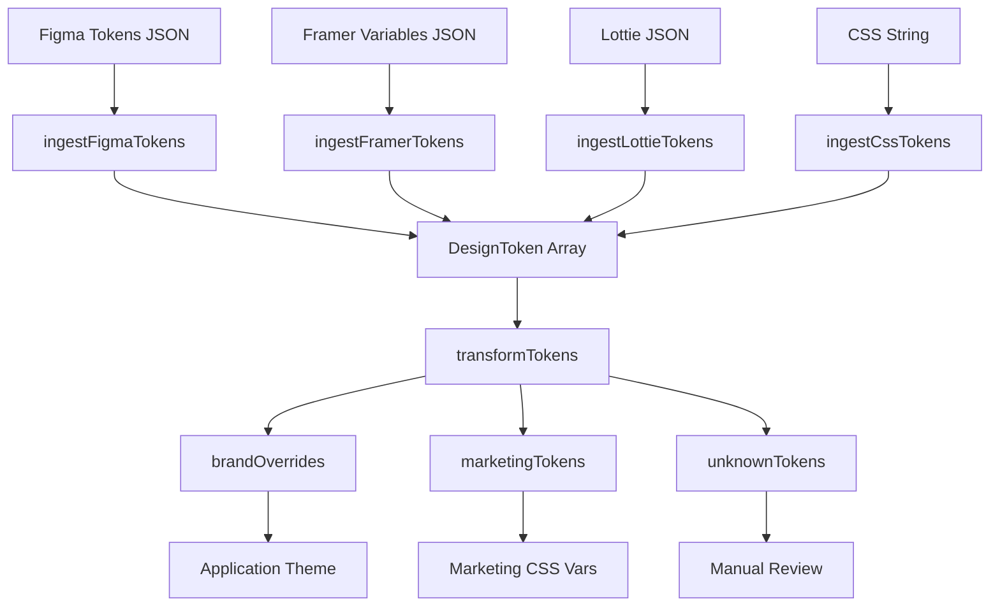

## Overview

Design teams export tokens from multiple tools: Figma Token Studio for color and typography, Framer for variable-driven layouts, Lottie for animation timing, and raw CSS files for existing codebases. Without a unified pipeline, engineers must manually reconcile formats and naming conventions — a brittle, error-prone process.

The Token Manager solves this by providing:

- **Four typed ingestion functions**, one per source format
- **Automatic category inference** based on token name patterns and source metadata
- **A deterministic transformer** that routes tokens into `brandOverrides`, `marketingTokens`, or `unknownTokens`
- **Pure, composable functions** that receive already-parsed data — no file I/O, no side effects

---

## Supported Sources

| Source | Format | Ingestion Function | Notes |
|--------|--------|--------------------|-------|
| Figma | Figma Tokens Studio JSON | `ingestFigmaTokens` | Recursive nested map; flattened to dot-path names |
| Framer | Framer Variables JSON | `ingestFramerTokens` | Flat array of `{ name, value, type, collection }` |
| Lottie | Lottie JSON animation | `ingestLottieTokens` | Extracts duration and frameRate timing tokens |
| CSS | Raw CSS string | `ingestCssTokens` | Parses `--custom-property: value;` declarations |

---

## Usage

### Figma Tokens Studio

Export your token set from the Figma Tokens Studio plugin as JSON, then pass the parsed object:

```typescript
import { ingestFigmaTokens, transformTokens } from '@nebutra/design-system/tokens';
import figmaExport from './tokens.figma.json';

const tokens = ingestFigmaTokens(figmaExport);
const output = transformTokens(tokens);

// output.brandOverrides — tokens named color.primary.*, color.brand.*, font.*, radius.*
// output.marketingTokens — tokens named color.marketing.*, gradient.*, animation.*
// output.unknownTokens — everything else, awaiting manual classification
```

Example Figma Tokens JSON structure:

```json
{
  "color": {
    "primary": {
      "500": {
        "value": "#0070F3",
        "type": "color",
        "description": "Primary action color"
      }
    }
  },
  "font": {
    "family": {
      "sans": {
        "value": "Inter",
        "type": "fontFamilies"
      }
    }
  }
}
```

### Framer Variables

Export from Framer using **File → Export → Variables**:

```typescript
import { ingestFramerTokens, transformTokens } from '@nebutra/design-system/tokens';
import framerExport from './variables.framer.json';

const tokens = ingestFramerTokens(framerExport);
const output = transformTokens(tokens);
```

Example Framer Variables JSON structure:

```json
{
  "variables": [
    {
      "name": "primary",
      "value": "#0070F3",
      "type": "color",
      "collection": "color.brand"
    },
    {
      "name": "borderRadius",
      "value": 8,
      "type": "number",
      "collection": "radius"
    }
  ]
}
```

### Lottie Animation

Pass a parsed Lottie JSON to extract timing tokens (`animation.duration` and `animation.frameRate`):

```typescript
import { ingestLottieTokens, transformTokens } from '@nebutra/design-system/tokens';
import lottieAnimation from './hero.lottie.json';

const tokens = ingestLottieTokens(lottieAnimation);
// tokens → [
//   { name: 'animation.duration', rawValue: '1333ms', category: 'animation', source: 'lottie' },
//   { name: 'animation.frameRate', rawValue: '30', category: 'animation', source: 'lottie' },
// ]

const output = transformTokens(tokens);
// output.marketingTokens['animation.duration'] === '1333ms'
```

### CSS Custom Properties

Pass raw CSS source (e.g. the contents of `globals.css`):

```typescript
import { ingestCssTokens, transformTokens } from '@nebutra/design-system/tokens';
import { readFileSync } from 'node:fs';

const cssSource = readFileSync('./globals.css', 'utf-8');
const tokens = ingestCssTokens(cssSource);
const output = transformTokens(tokens);
```

Example CSS input:

```css
:root {
  --color-primary: #0070F3;
  --font-size-base: 16px;
  --space-hero-gap: 64px;
  --animation-duration-fast: 150ms;
  --border-radius-card: 12px;
}
```

---

## Transformer Routing Rules

The `transformTokens` function applies routing rules in priority order:

### 1. brandOverrides

Tokens whose name starts with any of:

| Prefix | Maps to |
|--------|---------|
| `color.brand` | Brand palette overrides |
| `color.primary` | Primary color scale |
| `color.accent` | Accent color scale |
| `font` | Typography overrides |
| `radius` | Border radius scale |

### 2. marketingTokens

Tokens whose name starts with any of:

| Prefix | Maps to |
|--------|---------|
| `color.marketing` | Marketing-specific colors |
| `gradient` | Gradient definitions |
| `animation.duration` | Animation timing (from Lottie) |
| `animation.frameRate` | Frame rate metadata |
| `space.hero` | Hero section spacing |

### 3. unknownTokens

All remaining tokens are collected in `unknownTokens` as `DesignToken[]` for manual review or downstream processing.

---

## Architecture



---

## TypeScript Types

```typescript
type TokenCategory =
  | 'color'
  | 'typography'
  | 'spacing'
  | 'shadow'
  | 'radius'
  | 'animation'
  | 'unknown';

type TokenSource = 'figma' | 'framer' | 'lottie' | 'css' | 'manual';

interface DesignToken {
  name: string;        // Canonical dot-path name, e.g. "color.primary.500"
  rawValue: string;    // Raw value as provided by the source
  category: TokenCategory;
  source: TokenSource;
  description?: string;
  path?: string[];     // Path segments, e.g. ["color", "primary", "500"]
}

interface TransformerOutput {
  brandOverrides: Partial<Record<string, string>>;
  marketingTokens: Partial<Record<string, string>>;
  unknownTokens: DesignToken[];
}
```

---

## Combining Multiple Sources

Ingest from multiple sources and merge before transforming:

```typescript
import {
  ingestFigmaTokens,
  ingestCssTokens,
  ingestLottieTokens,
  transformTokens,
} from '@nebutra/design-system/tokens';

const allTokens = [
  ...ingestFigmaTokens(figmaExport),
  ...ingestCssTokens(cssSource),
  ...ingestLottieTokens(lottieJson),
];

const output = transformTokens(allTokens);
```

Note: When tokens from different sources share the same name, the last one wins. Sort by source priority before merging if determinism is required.
