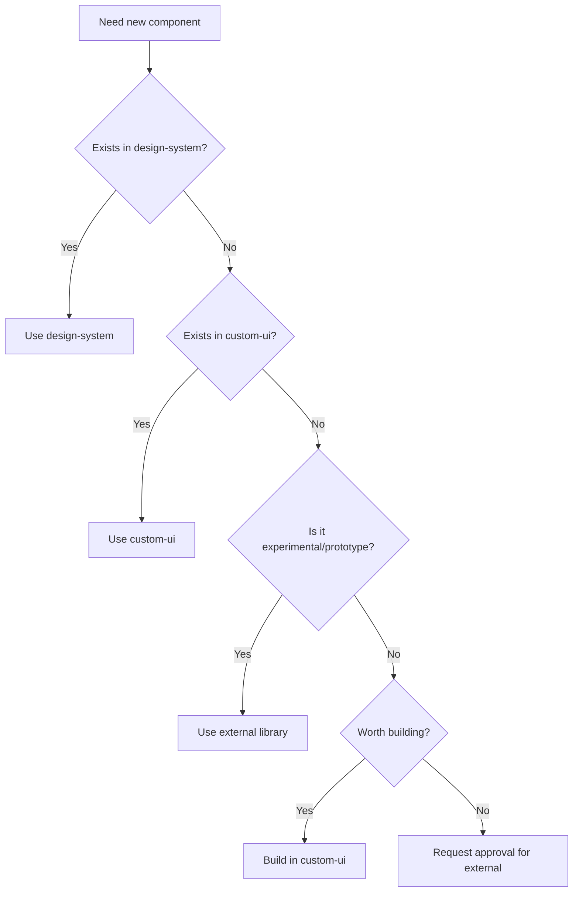

# Component Library Policy

This document defines the governance rules for managing UI components across Nebutra products, including when and how to use external libraries, the review process, and component lifecycle management.

## Overview

Nebutra uses a **layered component architecture** built on GitHub's Primer Design System:

```
┌─────────────────────────────────────────────────────────────────────┐
│                      External Libraries                            │
│                (HeroUI, Magic UI, etc.)                            │
│                       [Experimental]                                │
└───────────────────────────────┬─────────────────────────────────────┘
                                │ Review & Promote
                                ▼
┌──────────────────────────────────────────┐  ┌────────────────────┐
│  @nebutra/custom-ui                      │  │    @nebutra/ui     │
│  (Brand/Domain + shadcn-style)           │  │  (Lobe-style)      │
│       [Stable]                           │  │     [Stable]       │
└─────────────────────┬────────────────────┘  └──────────┬─────────┘
                      │                               │
                      └───────────────────────────────┘
                            Depends on
                                ▼
┌─────────────────────────────────────────────────────────────────────┐
│               @nebutra/design-system (SSOT)                        │
│                         [Stable]                                    │
├─────────────────┬─────────────────┬─────────────────┬────────────────┤
│  theme/           │  typography/    │  primitives/    │  components/   │
│  ├─ default       │  ├─ tokens      │  ├─ layout      │  ├─ Box        │
│  ├─ brand         │  ├─ fonts       │  ├─ spacing     │  ├─ Button     │
│  └─ marketing ★   │  └─ fonts.css   │  └─ a11y        │  └─ Card       │
└─────────────────┴─────────────────┴─────────────────┴────────────────┘
                                │
                                ▼
┌─────────────────────────────────────────────────────────────────────┐
│                    @primer/react                                    │
│             (GitHub Primer Design System)                          │
└─────────────────────────────────────────────────────────────────────┘
```

### Key Relationships

| Layer             | Foundation   | Typography                                | Brand/Marketing                     |
| ----------------- | ------------ | ----------------------------------------- | ----------------------------------- |
| **design-system** | Primer React | Open-source fonts (Inter, JetBrains Mono) | theme/brand.ts + theme/marketing.ts |
| **custom-ui**     | ↑ inherits   | ↑ inherits                                | Domain + shadcn-style               |
| **ui**            | ↑ inherits   | ↑ inherits                                | Lobe-style patterns                 |
| **External**      | May differ   | Must adapt                                | Requires integration                |

### Theme Modules (★ = new)

| Module              | Purpose                                           | Usage                        |
| ------------------- | ------------------------------------------------- | ---------------------------- |
| `theme/default`     | Primer baseline tokens (colors, spacing, shadows) | All apps - always loaded     |
| `theme/brand`       | Brand color overrides for white-label             | Multi-tenant customization   |
| `theme/marketing` ★ | Extended tokens for marketing pages               | Landing pages, hero sections |

**Marketing tokens include:**

- Large typography scales (display: 3-6rem, responsive)
- Gradient presets (primary, mesh, aurora, glass)
- Glass/Blur effects (glassmorphism, frosted)
- Extended spacing (section: 64-160px)
- Glow and shadow effects
- Transition timing presets

## Component Sources

### 1. @nebutra/design-system (SSOT)

**Status**: Always use first

The foundation layer built on **Primer React** providing:

> **Compatibility Note**: Runtime is React 19, but TypeScript type definitions are locked to `@types/react@18` via pnpm overrides for Primer React compatibility. This is a temporary measure until Primer React fully supports React 19 types. All React 19 features (Server Components, Actions, `use()`, etc.) work as expected.

- **Theme tokens** - colors, spacing, shadows, radii (Primer defaults + brand overrides)
- **Typography system** - Inter, JetBrains Mono, CJK fonts with rem-based scale
- **UI primitives** - layout, accessibility, responsive patterns
- **Base components** - Button, Box, Text, etc. (Primer re-exports)

**Internal Modules**:
| Module | Purpose |
|--------|--------|
| `theme/` | Primer color tokens, spacing, breakpoints |
| `typography/` | Font stacks, type scale, typeStyles presets |
| `primitives/` | Layout patterns, a11y utilities |
| `components/` | Primer + custom components |

**Rules**:

- ✅ Always import base components from here
- ✅ All custom components must use design-system tokens
- ✅ Use `typography/` for all font-related values
- ❌ Never override design-system tokens inline
- ❌ Never import directly from `@primer/react` in apps

### 2. @nebutra/custom-ui (Brand Layer)

**Status**: Use for production features

Contains:

- Domain-specific components (TenantSwitcher, PricingCard)
- Promoted components from external libraries
- Complex/composite UI (dashboards, data grids)

**Rules**:

- ✅ Use for reusable, production-ready UI
- ✅ Components must pass full review
- ❌ No experimental or unreviewed components

### 3. External Libraries (HeroUI, etc.)

**Status**: Use sparingly, with approval

**Rules**:

- ⚠️ Requires team approval before use
- ⚠️ Must document in component registry
- ✅ OK for one-off needs
- ❌ Don't use in multiple places without promotion

## Review Process

### Before Using External Components



### Component Review Checklist

Before promoting an external component to `custom-ui`:

#### 1. Visual Consistency

- [ ] Uses design-system color tokens
- [ ] Uses design-system spacing scale
- [ ] Uses design-system typography
- [ ] Follows layout patterns
- [ ] Matches overall visual style

#### 2. Accessibility

- [ ] Semantic HTML structure
- [ ] Proper ARIA attributes
- [ ] Keyboard navigable
- [ ] Focus states visible
- [ ] Color contrast meets WCAG AA
- [ ] Touch targets ≥ 44px

#### 3. Responsiveness

- [ ] Works on mobile (xs, sm)
- [ ] Works on tablet (md)
- [ ] Works on desktop (lg, xl)
- [ ] No horizontal scroll issues
- [ ] Text remains readable

#### 4. Performance

- [ ] Bundle size impact < 10KB gzipped
- [ ] No render-blocking issues
- [ ] Lazy-loadable if large
- [ ] No memory leaks
- [ ] Efficient re-renders

#### 5. Theming

- [ ] Supports light mode
- [ ] Supports dark mode
- [ ] Uses theme context
- [ ] No hard-coded colors

#### 6. Code Quality

- [ ] TypeScript types complete
- [ ] Props are well-documented
- [ ] No console warnings
- [ ] SSR compatible
- [ ] Tree-shakeable

## Promotion Process

When an external component is proven and needs to become stable:

### Step 1: Create Wrapper

```tsx
// packages/custom-ui/src/components/PromotedButton.tsx
"use client";

import { Button as ExternalButton } from "external-lib";
import { Box } from "@nebutra/design-system";
import type { ComponentMeta } from "../types";

export const PromotedButtonMeta: ComponentMeta = {
  name: "PromotedButton",
  source: "promoted",
  status: "stable",
  version: "1.0.0",
  promotedFrom: "external-lib",
  accessibilityLevel: "AA",
  responsive: true,
  themeable: true,
};

export interface PromotedButtonProps {
  // Define clean API
}

export function PromotedButton(props: PromotedButtonProps) {
  // Wrap with design-system integration
  return (
    <Box>
      <ExternalButton {...adaptedProps} />
    </Box>
  );
}
```

### Step 2: Add to Registry

```tsx
// packages/custom-ui/src/registry.ts
import { PromotedButtonMeta } from "./components/PromotedButton";

export const componentRegistry = {
  PromotedButton: PromotedButtonMeta,
  // ... other components
};
```

### Step 3: Update Imports Across Codebase

```bash
# Find all usages
grep -r "from 'external-lib'" apps/

# Update to use custom-ui
# Old: import { Button } from "external-lib";
# New: import { PromotedButton } from "@nebutra/custom-ui";
```

### Step 4: Document Migration

Add to CHANGELOG and create migration guide if needed.

## Deprecation Process

When a component needs to be removed:

### Step 1: Mark as Deprecated

```tsx
export const OldComponentMeta: ComponentMeta = {
  name: "OldComponent",
  status: "deprecated",
  deprecatedReason: "Replaced by NewComponent for better accessibility",
  replacedBy: "NewComponent",
};
```

### Step 2: Add Console Warning

```tsx
export function OldComponent(props) {
  if (process.env.NODE_ENV === "development") {
    console.warn(
      "OldComponent is deprecated. Use NewComponent instead. " +
        "See migration guide: docs/migrations/old-to-new.md",
    );
  }
  // ... component code
}
```

### Step 3: Set Removal Timeline

- **Minor version**: Mark deprecated, add warnings
- **Next minor**: Remove from docs, hide from autocomplete
- **Next major**: Remove completely

## Allowed External Libraries

### Pre-Approved

These libraries can be used without additional approval:

| Library               | Use Case   | Notes                  |
| --------------------- | ---------- | ---------------------- |
| @radix-ui/\*          | Primitives | Via @nebutra/custom-ui |
| framer-motion         | Animation  | Production-ready       |
| lucide-react          | Icons      | Fallback icons         |
| recharts              | Charts     | Data visualization     |
| @tanstack/react-table | Tables     | Complex data grids     |

### Requires Approval

Request approval before using:

| Library     | Review Focus                |
| ----------- | --------------------------- |
| HeroUI      | Bundle size, theme compat   |
| Material UI | Bundle size, style conflict |
| Chakra UI   | Style conflict, overlap     |
| Ant Design  | Bundle size, style conflict |

### Not Recommended

Avoid these unless absolutely necessary:

| Library     | Reason                 |
| ----------- | ---------------------- |
| Bootstrap   | Style conflicts        |
| Semantic UI | Outdated, large bundle |
| Foundation  | Style conflicts        |

## Component Registry

All components should be tracked:

```tsx
// packages/custom-ui/src/registry.ts
export interface RegistryEntry {
  name: string;
  package: string;
  source: ComponentSource;
  status: ComponentStatus;
  usedIn: string[]; // List of apps/features
  lastReviewed?: string; // ISO date
  owner?: string; // Team or person responsible
}

export const registry: Record<string, RegistryEntry> = {
  // Populated by audit tooling
};
```

## Audit & Compliance

### Automated Checks

Run weekly via CI:

```bash
# Check for unapproved external imports
pnpm run component-audit

# Output report
# - External library usage
# - Deprecated component usage
# - Missing registry entries
# - Style token violations
```

### Manual Review

Quarterly review of:

- Component usage patterns
- Bundle size trends
- Accessibility compliance
- Deprecation timeline adherence

## FAQ

### Q: Can I quickly use an external component for a prototype?

**A**: Yes, use `@nebutra/custom-ui` or external libraries for prototypes. Just don't ship to production without review.

### Q: What if design-system doesn't have what I need?

**A**:

1. Check if `custom-ui` has it
2. Check external libraries (HeroUI, MagicUI, etc.)
3. Request addition to design-system (for base components)
4. Build in custom-ui (for domain-specific)

### Q: How long does promotion take?

**A**: Typically 1-2 sprints:

- Week 1: Review and wrapper creation
- Week 2: Migration and documentation

### Q: Who approves external library usage?

**A**: The UI/Design System team or tech lead. Create an issue/PR with justification.

## Related

- [UI Guidelines](./UI-GUIDELINES.md) - Design token and style rules
- [Typography](./TYPOGRAPHY.md) - Font system and text styles
- [@nebutra/design-system](../packages/design-system/README.md) - Primer-based SSOT
- [@nebutra/custom-ui](../packages/custom-ui/README.md) - Brand-specific & shadcn-style components
