# 云毓智能 品牌视觉识别手册

Nebutra Brand visual identity manual

# 目录 三录

# / CONTENT

# A

# 品牌基本要素

# Brand Basic Elements

品牌标准标志

品牌标志墨稿

品牌标志方格制图

安全空间与最小化比例限定

使用限定

品牌中文名称方格制图

品牌英文名称方格制图

品牌中英文组合方格制图

品牌标准中文字体

品牌标准英文字体

品牌标准色及色阶

品牌辅助色及色阶

色彩禁用示例

标志左右组合

标志上下组合

标志左右组合-英文

标志上下组合-英文

# B

# 品牌标志应用

# Application of brand logo

接待台及背景墙

路演板 / 展板

# A品牌基本要素

# Brand Basic Elements

# 品牌标准标志

品牌标志以首字母N的基础造型概念为主要设计框架，但又不直白的体现首字母的造型，通过几何正负空间构建隐形“N”，通过对基础图形的旋转变换，形成一个近似六边形的稳定结构。

色彩上使用清新明快的蓝绿渐变，通过线性渐变与角度渐变的方式填充其中，让整体更具未来感与科技的锋芒。整体表达品牌探索与引领未来，创建智能化连接的理念”

# 品牌标志墨稿

品牌标志墨稿是以黑白色调呈现的标志设计稿，它在品牌视觉体系中有着不可或缺的作用。首先，墨稿能精准检验标志的结构合理性与图形识别性，剥离色彩干扰后，标志的线条粗细、图形比例、元素关系等细节问题会清晰暴露，帮助设计师及时优化，确保标志在任何场景下都能保持清晰易辨。

其次，墨稿能强化品牌标志的通用性，黑白配色不受印刷工艺、显示设备色彩差异的限制，无论是单色印刷品、黑白显示屏，还是烫金、压印等特殊工艺，都能保证标志完整呈现，有效提升品牌传播的稳定性。

  
标志反白

  
标志反白

  
标志烫金

  
标志烫银

# 品牌标志方格制图

方格制图通过精确的网格比例，规定标志中各元素（如线条、图形、文字）的尺寸、间距等参数，确保无论在任何场景下（如印刷、屏幕展示、实体制作），标志的形态都保持统一，避免因手工绘制或缩放导致的变形、比例失调。

7.5a

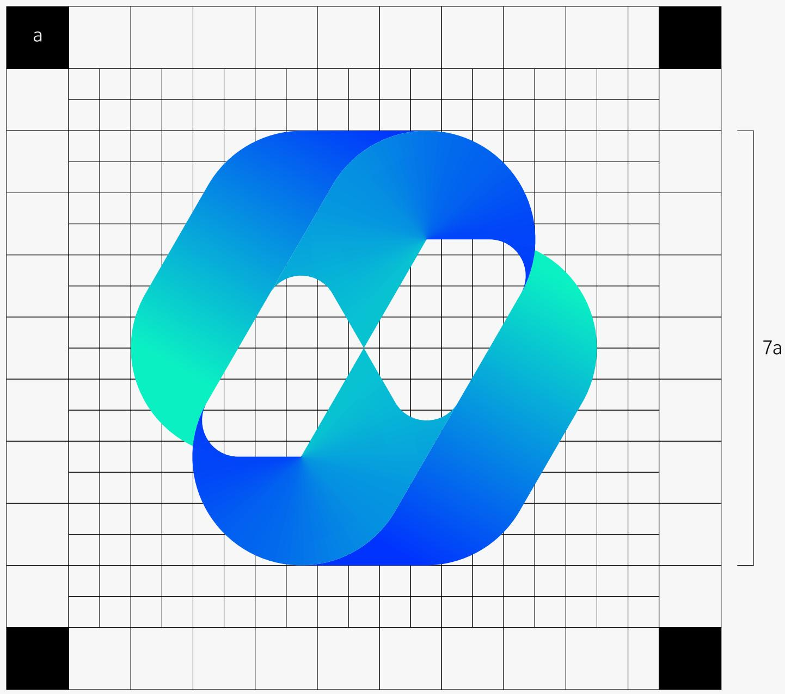

# 安全空间

# 与最小化比例限定

在应用品牌视觉识别系统时，需严格遵守以下规范，确保品牌形象统一、专业。

标志使用 ：标志应用时必须保留安全空间（最小边距不小于标志高度的1�4），避免元素挤压；最小尺寸要求：印刷媒体高度≥6mm，数字媒体高度 $2 3 5 \mathrm { p } \times \mathrm { _ { \circ } }$ 。优先使用彩色标识，允许单色版，但禁止在浅色或复杂背景中使用反白标识，以防辨识度降低。

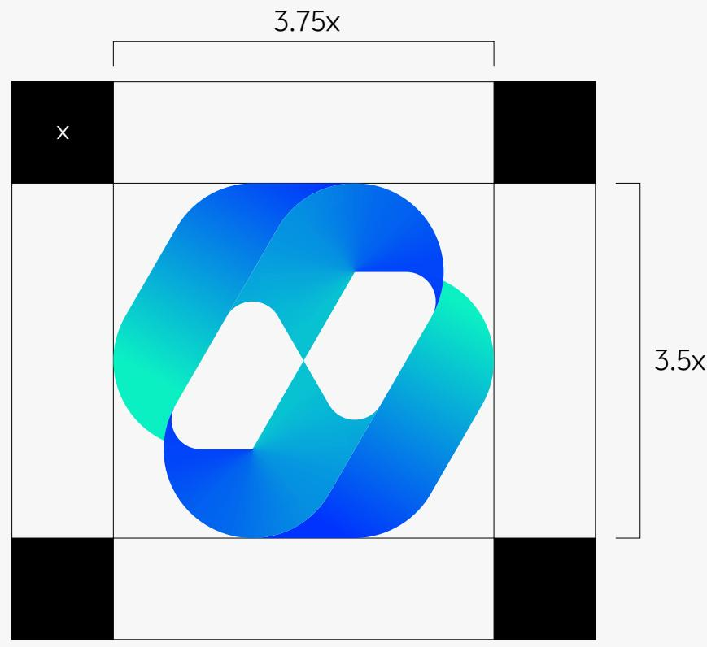  
a. 品牌标志使用安全空间

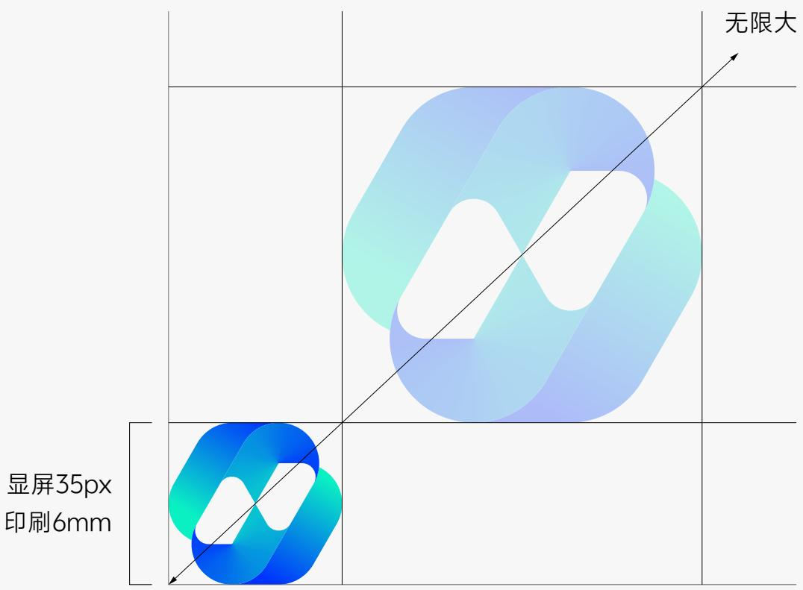  
b. 品牌标志在印刷媒体上最小使用：高度大于等于6mm在网络媒体上最小使用：高度大于等于35px

# 使用限定

规定品牌标志的使用限定（即明确标志在不同场景下的禁用规则、限制条件等）是品牌视觉管理的核心环节，其作用与方格制图的 “正向规范” 形成互补，从 “反向约束” 角度保障品牌标志的完整性、识别性和品牌形象的一致性。

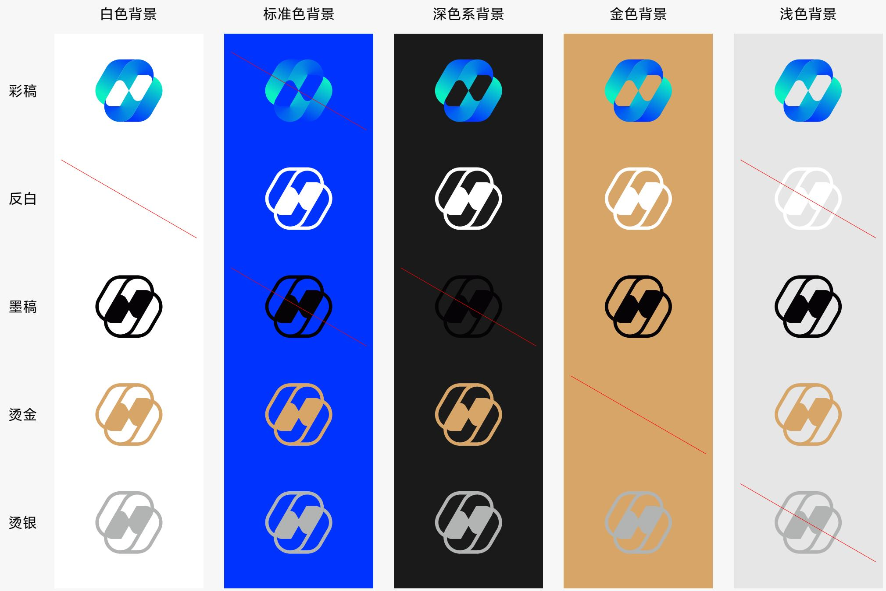

# 品牌中文名称方格制图

方格制图通过精确的网格比例，规定标志中各元素（如线条、图形、文字）的尺寸、间距等参数，确保无论在任何场景下（如印刷、屏幕展示、实体制作），标志的形态都保持统一，避免因手工绘制或缩放导致的变形、比例失调。

13.5a

# 疏起 一 1

3a

# 品牌英文名称方格制图

方格制图通过精确的网格比例，规定标志中各元素（如线条、图形、文字）的尺寸、间距等参数，确保无论在任何场景下（如印刷、屏幕展示、实体制作），标志的形态都保持统一，避免因手工绘制或缩放导致的变形、比例失调。

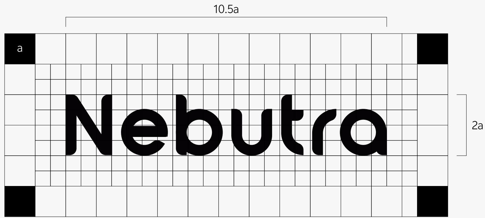

# 品牌中英文组合方格制图

方格制图通过精确的网格比例，规定标志中各元素（如线条、图形、文字）的尺寸、间距等参数，确保无论在任何场景下（如印刷、屏幕展示、实体制作），标志的形态都保持统一，避免因手工绘制或缩放导致的变形、比例失调。

13.5a

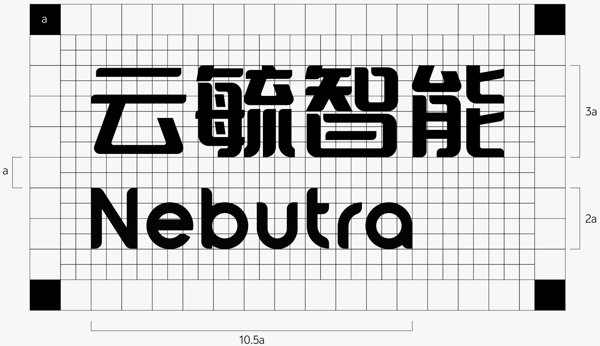

# 品牌标准中文字体

为使视觉形象更加统一，企业对内办公、传播文件等在一般情况下应用本章规定的专用字体。

在一般情况下使用品牌标识，应尽量使用提供的电子文件，不建议重绘标识。尽量避免在重绘中出现误差。

无锡云毓智能科技有限公司

vivo Sans Light

无锡云毓智能科技有限公司

vivo Sans Regular

无锡云毓智能科技有限公司

vivo Sans Medium

无锡云毓智能科技有限公司

vivo Sans DemiBold

无锡云毓智能科技有限公司

vivo Sans Bold

# 品牌标准英文字体

为使视觉形象更加统一，企业对内办公、传播文件等在一般情况下应用本章规定的专用字体。

在一般情况下使用品牌标识，应尽量使用提供的电子文件，不建议重绘标识。尽量避免在重绘中出现误差。

Poppins Regular

ABCDEFGHI JKLMNOPQRSTUVWXYZ abcdefghijklmnopqrstuvwxyz 1234567890 # $ @%&,.-+()

Poppins Medium

ABCDEFGHI JKLMNOPQRSTUVWXYZ abcdefghijklmnopqrstuvwxyz 1234567890 # $ @%&,.-+()

Poppins SemiBold

ABCDEFGHI JKLMNOPQRSTUVWXYZ abcdefghijklmnopqrstuvwxyz 1234567890 # $ @%&,.-+()

# 品牌标准色及色阶

云毓蓝品牌的核心标准色。蓝色象征科技与信任，契合云毓智能在AI-SaaS与云端数据智能领域的专业定位。“云”代表云端平台，“毓”寓意孕育与转化。这一色彩诠释了我们致力于将分散数据在云端整合、处理，并转化为有价值产品与服务的使命。它体现了创新、可靠与无限潜力，传递出公司在智能科技领域的前瞻性与突破精神。

# 云毓蓝

Nebutra Blue

HTML

#0033FE

RGB

0 51 254

# 品牌辅助色及色阶

品牌主要辅助色定义为“云毓青”。它源于数据流动与智能交互的瞬间，青色的通透感象征着信息的清晰与算法的灵动。这一色彩代表了云毓智能在整合与处理数据过程中的高效与精准，体现了从原始数据到智慧产品的转化路径。

它与主色云毓蓝相辅相成，共同构建出我们可靠而不失创新、专业而充满活力的品牌形象，展现了智能科技与自然生机融合的未来感。

# 云毓青

Nebutra Cyan

HTML

#0BF1C3

RGB

11 241 195

# 白

White

HTML

#FFFFFF

RGB

255 255 255

# 黑

Black

HTML

#000000

RGB

0 0 0

# 色彩禁用示例

为了使品牌标准色彩在未来的传播中更加科学有效，我们设置标准色和辅助色的使用规范。

禁用高饱和度背景与颜色重叠，避免颜色过于刺眼，影响品牌形象；禁用明度过高的重叠颜色，避免影响内容的识别性。

# 允许使用

WE NEVER

STOP

APPROACHING

PERFECT.

云毓智能

Nebutra

# 禁止使用

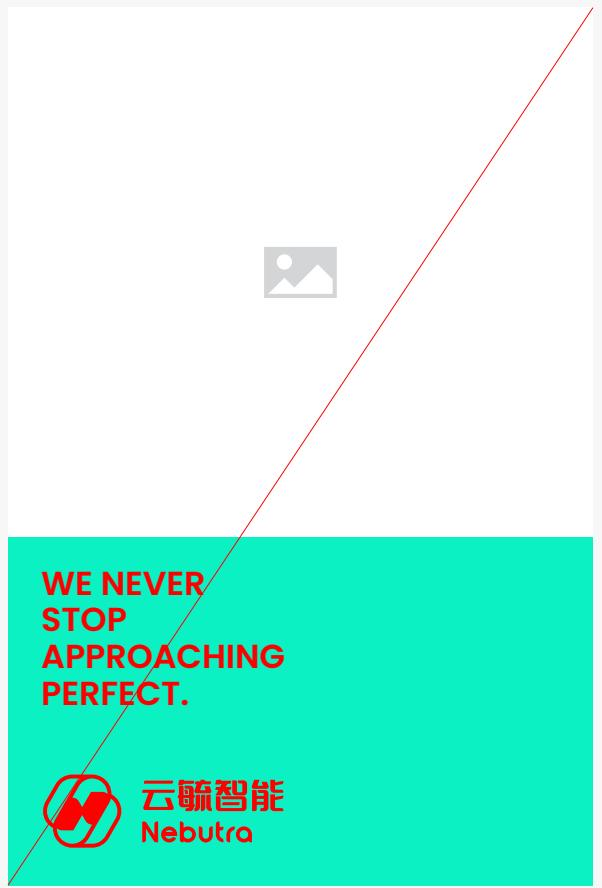  
$\oslash$ 禁用高饱和度背景与颜色重叠

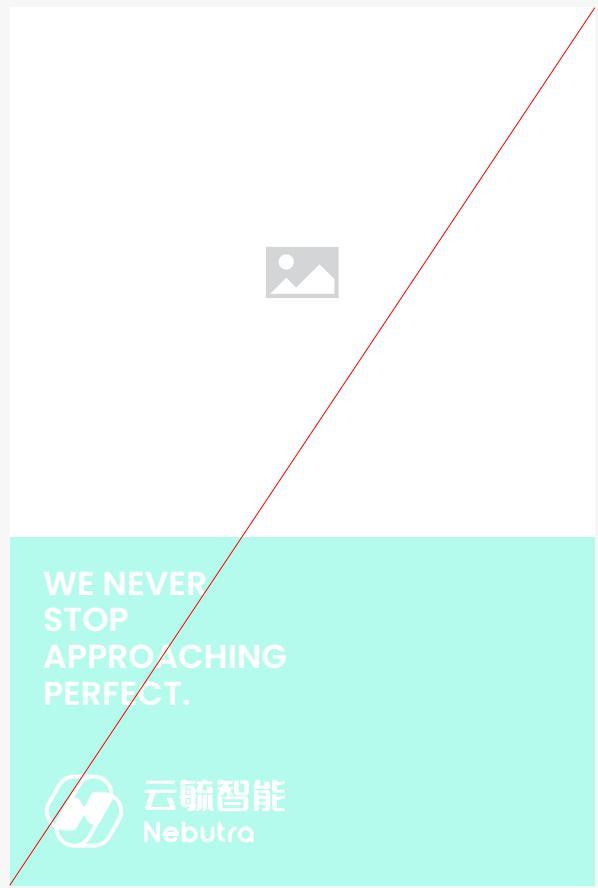  
$\cdot$ 禁用明度过高的重叠颜色

# 标志左右组合

标志的不同组合形式是品牌视觉系统适配多元场景的核心策略。

左右组合适配横向空间（如门店招牌、横幅广告），避免因空间限制导致标志变形或信息压缩，适合强调 “标志 $^ +$ 品牌名” 的同等重要性。

强化应用灵活性：不同组合形式能应对印刷、屏幕、实体物料等多样载体，确保在包装、工牌、社交媒体等场景中，标志始终清晰完整，维持品牌一致性。

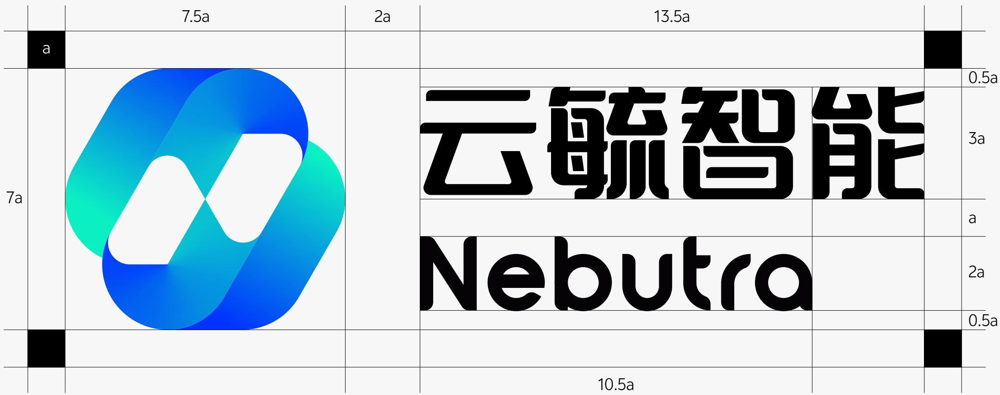

# 标志上下组合

标志的不同组合形式是品牌视觉系统适配多元场景的核心策略。

左右组合适配横向空间（如门店招牌、横幅广告），避免因空间限制导致标志变形或信息压缩，适合强调 “标志 $^ +$ 品牌名” 的同等重要性。

强化应用灵活性：不同组合形式能应对印刷、屏幕、实体物料等多样载体，确保在包装、工牌、社交媒体等场景中，标志始终清晰完整，维持品牌一致性。

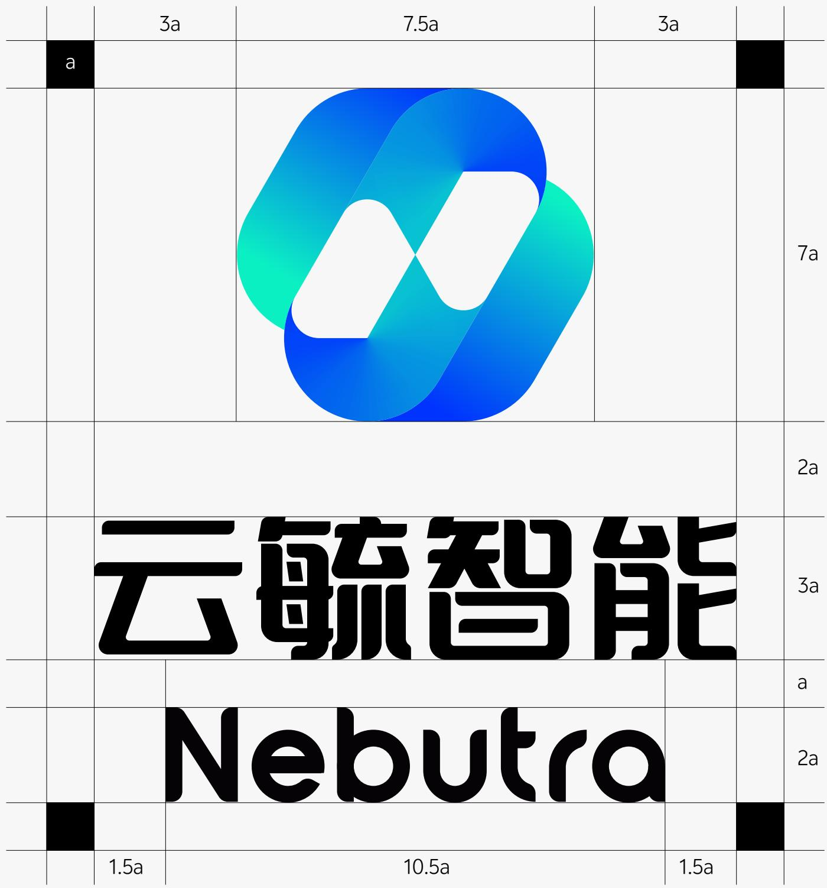

# 标志左右组合-英文

标志的不同组合形式是品牌视觉系统适配多元场景的核心策略。

左右组合适配横向空间（如门店招牌、横幅广告），避免因空间限制导致标志变形或信息压缩，适合强调 “标志 $^ +$ 品牌名” 的同等重要性。

强化应用灵活性：不同组合形式能应对印刷、屏幕、实体物料等多样载体，确保在包装、工牌、社交媒体等场景中，标志始终清晰完整，维持品牌一致性。

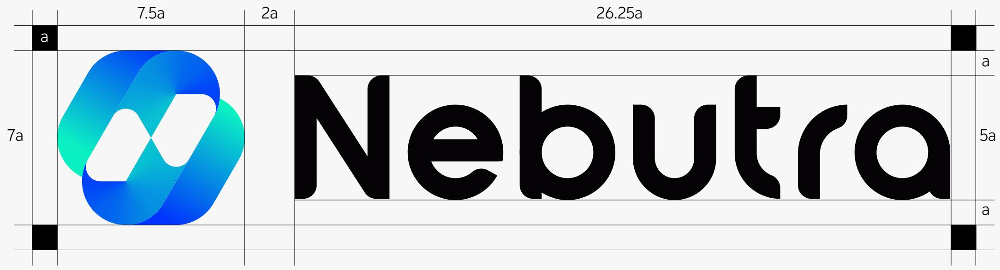

# 标志上下组合-英文

标志的不同组合形式是品牌视觉系统适配多元场景的核心策略。

左右组合适配横向空间（如门店招牌、横幅广告），避免因空间限制导致标志变形或信息压缩，适合强调 “标志 $^ +$ 品牌名” 的同等重要性。

强化应用灵活性：不同组合形式能应对印刷、屏幕、实体物料等多样载体，确保在包装、工牌、社交媒体等场景中，标志始终清晰完整，维持品牌一致性。

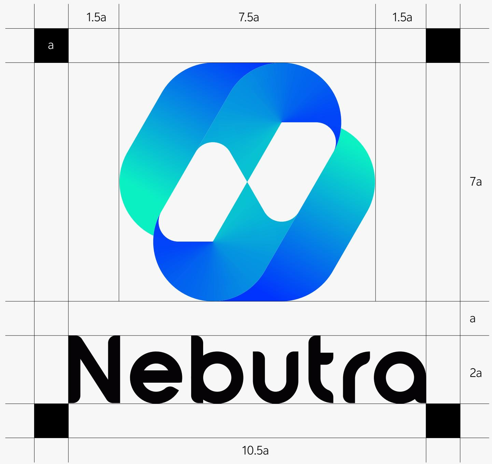

# B品牌标志应用

# Application of brand logo

# 路演板 / 展板

品牌展板与路演板是线下活动的核心视觉载体，承担着集中传递品牌信息、吸引受众并营造沉浸式体验的关键作用。设计上严格遵循VI标准，统一版式、色彩与字体规范，确保核心信息远距可视、一秒读懂。规范化的展板不仅能高效塑造专业权威的品牌形象，更能成为吸引客流、引导动线、并促成深度沟通的战略性媒介。

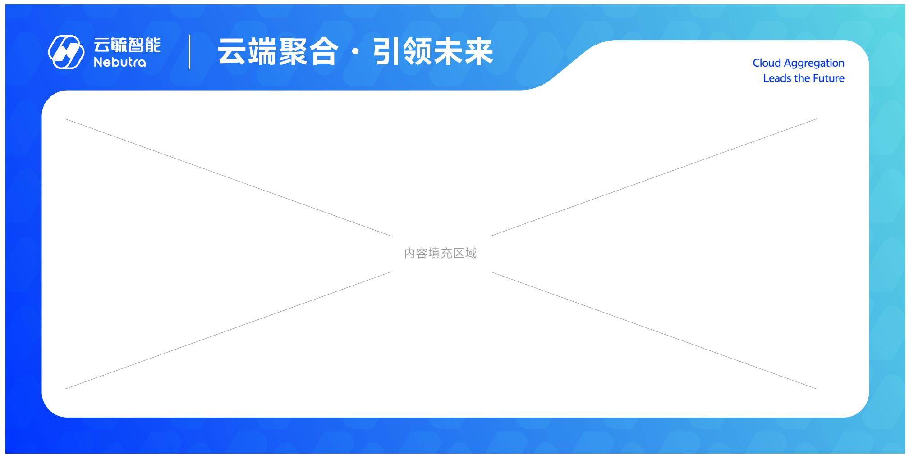  
横版

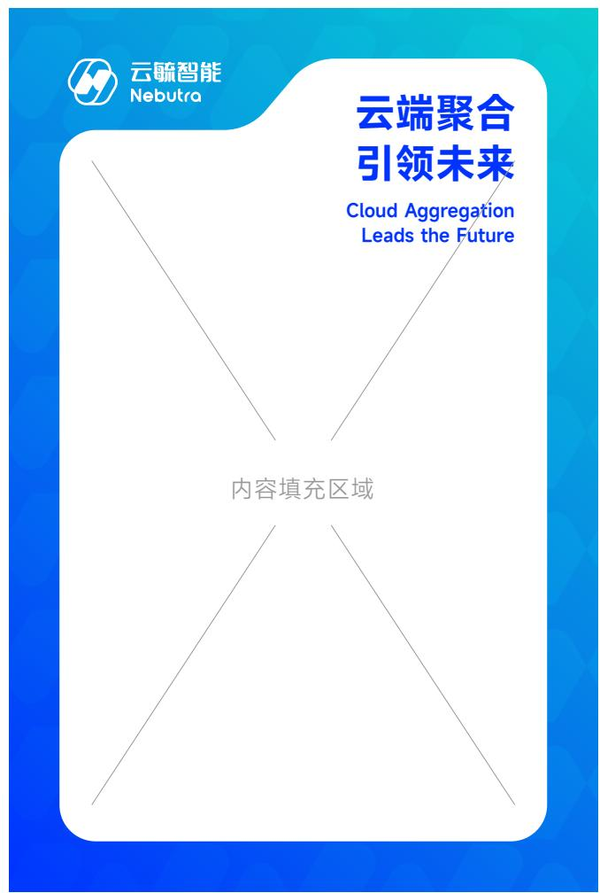  
竖版

# 接待台及背景墙

企业前台设计多层次的造型，整体线条与logo的设计呼应，第一层底板可采用纯色背景或浅色木纹效果，体现温馨与人文气息，两边增加LED的流水灯带，营造科技与未来的氛围感

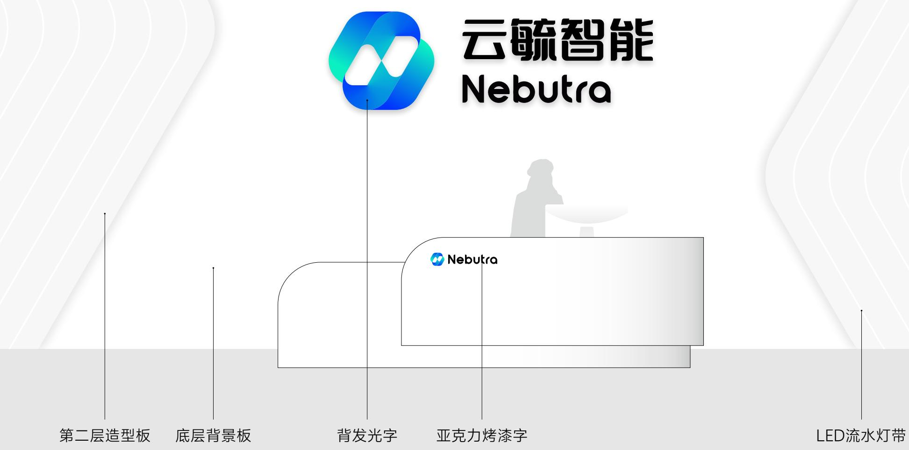

# ND
